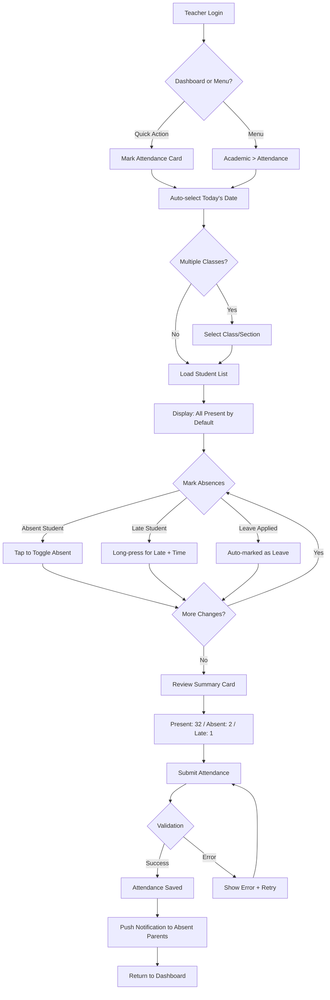
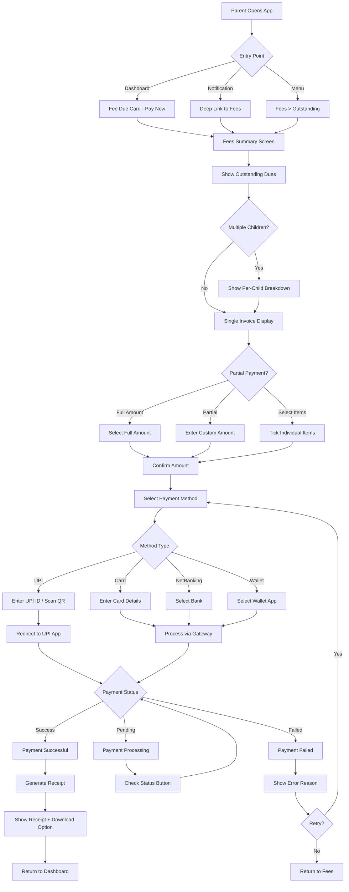
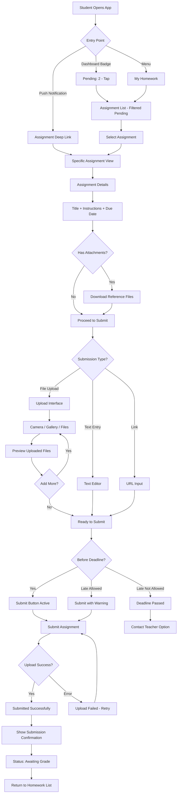
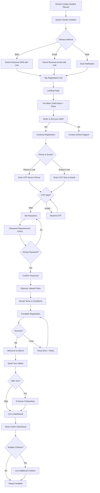

# UX Design Specification - MSLS

**Author:** Ashulabs
**Date:** 2026-01-23

---

## Executive Summary

### Project Vision

MSLS (Multi-School Learning System) is a future-ready, on-premise-first School ERP platform designed to serve educational institutions from Nursery to PhD level. The platform prioritizes data sovereignty, offline capability, and flexible deployment (SaaS or on-premise license).

**Core Value Proposition:**
- Schools own their data with on-premise-first architecture
- Works on LAN without internet dependency
- Scales from single school to multi-branch consortiums
- Module-based activation per institution type

### Target Users

**Primary Portals and Users:**

| Portal | Users | Key Needs |
|--------|-------|-----------|
| **Admin Dashboard** | Super Admin, School Admin, Principal | Full visibility, approvals, reports, configuration |
| **Staff Portal** | Teachers, Accountants, Librarians, Transport | Daily operations, specialized module access |
| **Parent Portal** | Parents/Guardians | Child monitoring, fee payment, communication |
| **Student Portal** | Students | Learning resources, homework, results, quizzes |

**User Characteristics:**
- **Admin/Staff**: Desktop-primary, data-entry heavy, need efficiency
- **Parents**: Mobile-primary, notification-driven, time-constrained
- **Students**: Mobile-primary, engagement-focused, need simplicity

### Key Design Challenges

1. **Multi-Portal Complexity**: 4 distinct portals with overlapping but role-specific views
2. **Offline-First Architecture**: PWA must function seamlessly offline with clear sync status
3. **Information Density**: Dashboards aggregating attendance, fees, grades, and alerts
4. **Mobile-First Requirements**: Parent and student interactions primarily on mobile
5. **Complex Multi-Step Workflows**: Admissions (7 stages), fee collection, exam management
6. **Localization Requirements**: Support for Hindi, English, and regional languages
7. **Accessibility**: Age-appropriate interfaces (primary vs secondary students)

### Design Opportunities

1. **Role-Optimized Dashboards**: Tailored views showing exactly what each role needs
2. **Smart Contextual Notifications**: Proactive alerts for absence, fee dues, results
3. **One-Tap Quick Actions**: Mark attendance, pay fees, view today's schedule
4. **Visual Progress Indicators**: Charts, calendars, progress bars for engagement
5. **Unified Mobile App**: Single app with role-based adaptive interface
6. **Offline-First Excellence**: Seamless offline/online transitions as competitive advantage

### Responsive Design Mandate

**All screens MUST be fully responsive across:**

| Breakpoint | Width | Target Devices |
|------------|-------|----------------|
| Mobile | < 640px | Phones (portrait) |
| Tablet | 640px - 1024px | Tablets, phones (landscape) |
| Desktop | 1024px - 1280px | Laptops, small monitors |
| Large Desktop | > 1280px | Large monitors |

**Responsive Strategy:**
- **Mobile-First CSS**: Design for mobile, enhance for larger screens
- **Fluid Typography**: Scale text using `clamp()` for readability
- **Adaptive Layouts**: Stack on mobile, grid on desktop
- **Touch-Friendly**: Minimum 44px tap targets on all interactive elements
- **Collapsible Navigation**: Hamburger menu on mobile, sidebar on desktop

## Core User Experience

### Defining Experience

**Per-Portal Core Actions:**

| Portal | Primary Action | Success Metric |
|--------|---------------|----------------|
| Teacher | Attendance marking + homework assignment | < 30 sec for 40 students |
| Parent | Progress monitoring + fee payment | 3 taps to complete payment |
| Student | Homework submission + quiz taking | Seamless flow start to submit |
| Admin | Approval processing + report generation | Batch actions, quick filters |

### Platform Strategy

**Responsive-First Architecture:**
- Single Angular codebase serving all screen sizes
- PWA with offline capability (Service Workers + IndexedDB)
- Installable on mobile devices as native-like app
- Touch-optimized interface across all breakpoints

**Portal-Specific Optimization:**

| Portal | Primary Device | Optimization Focus |
|--------|---------------|-------------------|
| Admin/Staff | Desktop/Laptop | Keyboard shortcuts, data tables, bulk actions |
| Parent | Mobile | Large tap targets, swipe gestures, notifications |
| Student | Mobile/Tablet | Engaging visuals, gamification elements, easy uploads |

### Effortless Interactions

**Zero-Friction Design Goals:**

1. **Attendance**: Absent-only marking (mark exceptions, not every student)
2. **Payments**: Saved payment methods, 1-tap repeat payments
3. **Communication**: Pre-templated messages, quick replies
4. **Navigation**: Role-based shortcuts, recent actions, smart search
5. **Forms**: Auto-fill from context, progressive validation, drafts auto-saved

### Critical Success Moments

**Make-or-Break Interactions:**

1. **First Dashboard Load**: User immediately understands their priorities
2. **Attendance Submission**: Confirmation with undo option
3. **Payment Completion**: Clear receipt, instant reflection in dues
4. **Result Viewing**: Detailed breakdown with improvement suggestions
5. **Offline Transition**: Seamless with clear sync status indicator

### Experience Principles

| Principle | Description | Application |
|-----------|-------------|-------------|
| **Instant Relevance** | Show what matters now | Role-based dashboards, contextual widgets |
| **Minimal Taps** | 3-tap maximum for any action | Streamlined workflows, smart defaults |
| **Proactive Communication** | Notify before users ask | Push notifications, status updates |
| **Offline Parity** | Full offline functionality | IndexedDB sync, queue offline actions |
| **Progressive Disclosure** | Simple default, detail on demand | Expandable cards, drill-down views |
| **Role Optimization** | Tailored per user type | Separate portal experiences |

## Desired Emotional Response

### Primary Emotional Goals

| User Type | Target Emotion | Design Trigger |
|-----------|---------------|----------------|
| Parent | Peace of Mind | Real-time visibility, proactive notifications |
| Teacher | Efficiency | Quick task completion, streamlined workflows |
| Student | Engagement | Interactive elements, progress visualization |
| Admin | Control | Comprehensive dashboards, batch operations |
| Principal | Confidence | Analytics, trend indicators, no surprises |

### Emotional Journey Mapping

**First-Time User Journey:**
1. **Discovery**: "This looks professional and trustworthy" → Clean, branded interface
2. **Onboarding**: "This understands my role" → Role-specific welcome flow
3. **First Action**: "That was easier than expected!" → Guided completion with success feedback

**Daily User Journey:**
1. **Login**: "I know exactly where to go" → Persistent state, smart defaults
2. **Core Task**: "Quick and painless" → Optimized workflows, minimal friction
3. **Completion**: "Done! What's next?" → Clear feedback, suggested actions

**Error Recovery Journey:**
1. **Problem**: "I see what to do" → Actionable error messages
2. **Resolution**: "Handled smoothly" → One-click fixes where possible
3. **Recovery**: "Back on track" → State preservation, auto-recovery

### Micro-Emotions

**Emotions to Cultivate:**
- Clarity over confusion
- Confidence over doubt
- Accomplishment over frustration
- Trust over skepticism
- Control over helplessness

**Emotion-Interaction Mapping:**

| Moment | Cultivate | Prevent |
|--------|-----------|---------|
| Data Loading | Patience (skeleton screens) | Anxiety (blank screens) |
| Form Submission | Confidence (validation) | Doubt (silent failures) |
| Payment | Trust (security indicators) | Fear (unclear process) |
| Notifications | Informed (contextual) | Overwhelmed (noise) |

### Design Implications

**Trust-Building Elements:**
- Consistent visual language across all portals
- Clear data attribution ("Last updated: 2 mins ago")
- Secure payment indicators (SSL badges, payment logos)
- Transparent sync status for offline mode

**Efficiency Indicators:**
- Time-saved feedback ("Attendance marked in 12 seconds")
- Batch operation summaries
- Keyboard shortcut hints
- Recent actions for quick repeat

**Engagement Mechanics:**
- Progress bars for multi-step processes
- Celebration moments (homework submitted, fees paid)
- Visual streaks (attendance trends, learning progress)
- Achievement badges for students (optional)

### Emotional Design Principles

1. **Clarity First**: When in doubt, simplify. Confused users feel negative emotions.
2. **Celebrate Success**: Acknowledge task completion with appropriate feedback.
3. **Soften Failures**: Errors should guide, not blame. Always show next steps.
4. **Build Trust Gradually**: Small positive interactions compound into loyalty.
5. **Respect Attention**: Don't interrupt unless truly important. Batch notifications.
6. **Enable Recovery**: Always provide undo, back, and cancel options.

## UX Pattern Analysis & Inspiration

### Inspiring Products Analysis

| Product | Key Patterns to Learn |
|---------|----------------------|
| **Google Classroom** | Assignment lifecycle, stream-based updates, class-centric navigation |
| **WhatsApp** | Read receipts, notification badges, simple communication |
| **Google Pay** | 1-tap payments, recent payees, instant transaction status |
| **Linear** | Command palette, keyboard shortcuts, dense data tables |
| **Notion** | Progressive disclosure, flexible views, clean hierarchy |
| **Swiggy/Uber** | Real-time status tracking, quick actions, mobile-first |

### Transferable UX Patterns

**Navigation:**
- Command Palette (Cmd+K) for admin power users
- Bottom Tab Bar for mobile parent/student portals
- Sidebar + Content for staff desktop experience
- Card-based activity feeds on dashboards

**Interactions:**
- Swipe actions for quick attendance/notification handling
- Pull-to-refresh on all list views
- Long-press context menus for mobile
- Skeleton screens during data loading
- Toast notifications for action confirmations

**Data Display:**
- Calendar heatmaps for attendance visualization
- Progress rings for completion tracking
- Inline spark charts for trends
- Color-coded status pills for quick scanning

### Anti-Patterns to Avoid

| Avoid | Instead Use |
|-------|-------------|
| Excessive modals | Inline editing, slide-over panels |
| Dropdown-heavy forms | Radio buttons, segmented controls |
| Hidden navigation | Visible tabs, clear menu structure |
| Silent failures | Toast confirmations, inline errors |
| Information overload | Progressive disclosure, smart defaults |
| Tiny touch targets | 44px minimum tap areas |
| PDF-only reports | HTML-first with PDF export |
| Full page reloads | SPA with state preservation |

### Design Inspiration Strategy

**Direct Adoption:**
- Skeleton loading states (Facebook/LinkedIn style)
- Toast notifications (modern web app standard)
- Pull-to-refresh gesture (mobile universal)
- Status pill components (Linear style)
- Bottom navigation (mobile standard)

**Contextual Adaptation:**
- Google Classroom assignment flow → Indian school homework context
- Linear command palette → Role-aware navigation shortcuts
- Google Pay payment UX → School fee specifics (installments, partial)
- WhatsApp notifications → Educational context (results, homework, fees)

**Explicit Avoidance:**
- Government portal aesthetics
- Desktop-only legacy ERP patterns
- Complex nested menu structures
- Auto-logout without state save
- Mandatory fields when optional works

## Design System Foundation

### Design System Choice

**Selected:** Tailwind CSS + Custom Angular Component Library

**Rejected Alternatives:**
- PrimeNG - Heavy, generic appearance
- Angular Material - Google design language limits differentiation
- Ant Design - Enterprise-heavy, Chinese conventions

### Rationale for Selection

| Factor | Tailwind + Custom |
|--------|------------------|
| Brand Identity | Full control over visual language |
| Performance | PurgeCSS removes unused styles |
| Customization | Components built for exact use cases |
| Responsive | Mobile-first utilities native |
| Long-term | No fighting library limitations |

### Implementation Approach

**Atomic Design Structure:**
```
shared/components/
├── atoms/       → Button, Input, Badge, Icon
├── molecules/   → FormField, Card, Dropdown, Toast
├── organisms/   → DataTable, Sidebar, Header, Calendar
└── templates/   → AdminLayout, AuthLayout, MobileLayout
```

**Build Sequence:**
1. Design tokens (colors, spacing, typography)
2. Atom components (buttons, inputs)
3. Molecule components (forms, cards)
4. Organism components (tables, navigation)
5. Page templates (layouts)

### Customization Strategy

**Design Tokens:**
- Primary: Blue (#3b82f6) - Trust, professionalism
- Success: Green (#10b981) - Positive actions
- Warning: Amber (#f59e0b) - Attention needed
- Danger: Red (#ef4444) - Destructive actions
- Spacing: 4px base unit (4, 8, 16, 24, 32)
- Border radius: 4px (sm), 8px (md), 12px (lg)

**Component Priorities:**
- Phase 1: 15 core components for MVP
- Phase 2: Role-specific components
- Phase 3: Advanced visualization components

## Defining User Experiences

### Per-Portal Defining Experiences

| Portal | Defining Experience | Success Statement |
|--------|--------------------|--------------------|
| Teacher | Mark attendance effortlessly | "40 students in 30 seconds" |
| Parent | Instant child visibility | "Open and see everything" |
| Student | Frictionless homework submission | "Upload and done" |
| Admin | Centralized oversight | "Nothing escapes attention" |

### User Mental Models

**Teacher:** Expects digital equivalent of paper register - simple grid, tap to mark
**Parent:** Expects real-time visibility like package tracking - open and see status
**Student:** Expects Google Classroom simplicity - upload, submit, see grade
**Admin:** Expects command center - all pending actions visible, bulk processing

### Success Criteria

| Experience | Metric | Target |
|------------|--------|--------|
| Attendance marking | Time for 40 students | < 30 seconds |
| Parent dashboard | Time to load | < 2 seconds |
| Homework submission | Taps to complete | < 3 taps |
| Admin approval | Time per item | < 5 seconds |

### Novel UX Patterns

**Absent-Only Attendance:**
- All students shown as present by default
- Teacher only taps to mark exceptions (absent/late)
- Reduces 40 taps to ~5 taps average

**Daily Summary Notifications:**
- Batch notifications into morning/evening digest
- "Today: Aarav - Present, 2 homeworks due, ₹15,000 fees pending"
- Reduces notification fatigue

**Quick Action Widgets:**
- Parent: "Pay ₹15,000" button directly on dashboard
- Teacher: "Mark 10-A Attendance" one-tap shortcut
- Admin: "5 pending approvals" swipe-to-approve

### Experience Mechanics

**Attendance Flow:**
1. Teacher opens app → Dashboard shows "Mark Attendance" CTA
2. Grid displays all students (green/present by default)
3. Tap student → Toggles to red/absent
4. Long-press → Late with reason dropdown
5. Submit → Toast confirmation with undo option

**Parent Dashboard Flow:**
1. Open app → Auto-loads today's summary
2. Attendance status + fee dues + pending homework visible
3. Tap any section → Detailed view
4. Pull-to-refresh → Latest data

**Homework Submission Flow:**
1. Notification or dashboard card → Assignment details
2. Tap Submit → Choose method (photo/file/text)
3. Upload with progress indicator
4. "Submitted ✓" confirmation with timestamp

## Visual Design Foundation

### Color System

**Primary Palette:**
- Primary: #3b82f6 (Blue) - Trust, professionalism
- Primary Light: #eff6ff - Backgrounds, hover states
- Primary Dark: #1d4ed8 - Active states, emphasis

**Semantic Colors:**
- Success: #10b981 - Present, paid, complete
- Warning: #f59e0b - Due soon, attention
- Danger: #ef4444 - Absent, overdue, errors
- Info: #3b82f6 - Informational, links

**Neutral Palette:**
- Background: #fafafa (gray-50)
- Surface: #ffffff (white)
- Border: #e4e4e7 (gray-200)
- Muted Text: #71717a (gray-500)
- Body Text: #3f3f46 (gray-700)
- Heading Text: #18181b (gray-900)

**Portal Accents:**
- Admin: Blue (#3b82f6)
- Teacher: Indigo (#6366f1)
- Parent: Teal (#14b8a6)
- Student: Purple (#8b5cf6)

### Typography System

**Font Stack:**
- Sans: Inter, Noto Sans, system-ui
- Mono: JetBrains Mono, Consolas

**Type Scale:**

| Level | Size | Weight | Usage |
|-------|------|--------|-------|
| xs | 12px | 400 | Captions |
| sm | 14px | 400 | Labels |
| base | 16px | 400 | Body |
| lg | 18px | 500 | Emphasis |
| xl | 20px | 600 | Card titles |
| 2xl | 24px | 600 | Sections |
| 3xl | 30px | 700 | Page titles |

### Spacing & Layout Foundation

**Spacing Scale (4px base):**
- 4px, 8px, 12px, 16px, 24px, 32px, 48px

**Grid System:**
- Mobile: 4 columns, 16px gutter
- Tablet: 8 columns, 24px gutter
- Desktop: 12 columns, 24px gutter

**Border Radius:**
- sm: 4px (buttons, inputs)
- md: 8px (cards)
- lg: 12px (modals)
- full: 9999px (avatars, badges)

### Accessibility Considerations

**Contrast Requirements:**
- All text meets WCAG 2.1 AA (4.5:1 minimum)
- Interactive elements clearly distinguishable
- Color not sole indicator (icons + color)

**Touch & Interaction:**
- 44px minimum touch targets
- 8px minimum between targets
- Visible focus states (2px ring)
- Skip links for keyboard users

**Motion & Animation:**
- Reduced motion media query support
- No auto-playing animations
- Transitions under 300ms

## Design Direction Decision

### Design Directions Explored

| Direction | Description | Best For |
|-----------|-------------|----------|
| Clean Professional | Dense tables, minimal chrome, sidebar nav | Admin/Staff |
| Card-Centric | Large cards, visual KPIs, bottom nav | Parent/Student |
| Hybrid Adaptive | Combines both based on viewport | Unified codebase |

### Chosen Direction

**Hybrid Adaptive** - Single codebase with role-appropriate experiences

**Admin/Staff (Desktop-First):**
- Collapsible sidebar navigation
- Dense data tables with sorting/filtering
- Compact statistics cards
- Bulk action toolbars

**Parent/Student (Mobile-First):**
- Bottom tab navigation
- Large touch-friendly cards
- Pull-to-refresh patterns
- Quick action buttons

### Design Rationale

1. **Single Codebase**: Shared component library reduces maintenance
2. **Role-Appropriate**: Each user gets optimized experience
3. **Responsive**: Same components adapt to viewport
4. **Consistent**: Unified visual language across portals
5. **Efficient**: Tailwind's responsive utilities enable this pattern

### Implementation Approach

**Layout Strategy:**
- Mobile-first CSS (default styles for mobile)
- Breakpoint overrides for tablet/desktop
- Shared components with conditional rendering
- Portal-specific layouts wrapping shared components

**Component Strategy:**
- Atomic design (atoms → molecules → organisms)
- Responsive by default
- Role variants where needed (e.g., compact vs spacious cards)

## User Journey Flows

### Teacher Daily Attendance Journey

**Goal**: Mark attendance for 35 students in under 60 seconds

**Entry Point**: Dashboard quick action or sidebar navigation



**Key Design Decisions**:
- **Absent-Only Marking**: All students default to present; only mark exceptions
- **Bulk Actions**: "Mark All Present" for quick confirmation
- **Offline Support**: Queue submissions when offline, sync when online
- **Undo Window**: 30-second undo after submission

---

### Parent Fee Payment Journey

**Goal**: Complete fee payment in under 2 minutes with minimal friction

**Entry Point**: Dashboard "Pay Now" button, Push notification, or Fees menu



**Key Design Decisions**:
- **Auto-Apply Discounts**: Sibling/staff discounts applied automatically
- **Saved Methods**: Remember last payment method
- **Instant Receipt**: PDF generated immediately after success
- **WhatsApp Share**: One-tap receipt sharing to family

---

### Student Homework Submission Journey

**Goal**: Submit homework with minimal clicks and clear progress feedback

**Entry Point**: Dashboard pending count, Push notification, or Homework menu



**Key Design Decisions**:
- **Auto-Save Drafts**: Every 30 seconds during text entry
- **Progress Indicator**: Clear submission progress bar
- **Deadline Countdown**: Prominent display of time remaining
- **Offline Queue**: Save submission locally, upload when online

---

### Parent First-Time Registration Journey

**Goal**: Complete registration in under 3 minutes with minimal data entry

**Entry Point**: SMS/Email invitation link from school



**Key Design Decisions**:
- **Pre-filled Data**: School provides child info, parent only verifies
- **OTP-First**: No email/password remembrance issues
- **Progressive Profile**: Required fields only, optional later
- **Multi-Child Linking**: Easy flow to add siblings

---

### Journey Patterns

**Navigation Patterns**:
- **Quick Actions First**: Dashboard prominently displays urgent actions
- **Contextual Deep Links**: Push notifications link directly to action screen
- **Breadcrumb Trail**: Always show where user is and how to go back
- **Smart Defaults**: Pre-select most likely option (today's date, full amount)

**Decision Patterns**:
- **Binary Defaults**: Default to most common choice (all present, full payment)
- **Undo Over Confirm**: Allow action with undo rather than pre-confirmation modals
- **Progressive Disclosure**: Show advanced options only when needed
- **Inline Validation**: Validate as user types, not on submit

**Feedback Patterns**:
- **Optimistic Updates**: Show success immediately, sync in background
- **Progress Indicators**: Clear visual for multi-step processes
- **Error Recovery**: Always provide next action when errors occur
- **Success Celebrations**: Brief, subtle animations on completion

---

### Flow Optimization Principles

**Minimize Steps to Value**:
- Teacher attendance: 3 taps to submit (open → mark absences → submit)
- Fee payment: 4 taps for saved payment method
- Homework submission: 3 taps for simple file upload

**Reduce Cognitive Load**:
- One primary action per screen
- Group related information visually
- Use familiar patterns (swipe to delete, pull to refresh)
- Show only relevant options based on context

**Error Prevention**:
- Disable submit until required fields complete
- Validate input format in real-time
- Confirm destructive actions only
- Auto-save work in progress

**Delight Moments**:
- Checkmark animation on attendance submit
- Confetti on fee payment success
- Star animation when homework graded with high marks
- Progress streak on student dashboard

## Component Strategy

### Design System Foundation

**Tailwind CSS as Styling Engine:**
- Utility-first approach for all styling
- Custom design tokens via `tailwind.config.js`
- PurgeCSS for production optimization
- No third-party UI library dependencies

**Custom Angular Component Library Structure:**
```
shared/components/
├── atoms/           → Smallest building blocks
├── molecules/       → Combined atoms with logic
├── organisms/       → Complex feature components
└── templates/       → Page-level layouts
```

### Atom Components

#### Button

**Purpose:** Primary interactive element for user actions

**Variants:**

| Variant | Usage | Tailwind Classes |
|---------|-------|-----------------|
| Primary | Main actions (Submit, Pay) | `bg-blue-600 text-white hover:bg-blue-700` |
| Secondary | Alternative actions | `bg-gray-100 text-gray-700 hover:bg-gray-200` |
| Danger | Destructive actions | `bg-red-600 text-white hover:bg-red-700` |
| Ghost | Tertiary actions | `text-blue-600 hover:bg-blue-50` |

**Sizes:** `sm` (32px), `md` (40px), `lg` (48px)

**States:** Default, Hover, Active, Disabled, Loading

**Accessibility:** `aria-label`, `aria-disabled`, keyboard focus ring

#### Input Field

**Purpose:** Text/number data entry

**Variants:** Text, Password, Number, Search, Textarea

**States:** Default, Focus, Filled, Error, Disabled

**Features:**
- Floating label animation
- Inline validation icons
- Character counter (optional)
- Password visibility toggle

#### Badge

**Purpose:** Status indicators and counts

| Type | Usage | Colors |
|------|-------|--------|
| Status | Present/Absent/Late | Green/Red/Amber |
| Count | Notification badges | Blue with number |
| Label | Category tags | Gray outline |

#### Avatar

**Purpose:** User/student photo display

**Sizes:** `xs` (24px), `sm` (32px), `md` (40px), `lg` (64px), `xl` (96px)

**Fallback:** Initials on colored background

#### Icon

**Purpose:** Visual indicators using Heroicons

**Sizes:** `sm` (16px), `md` (20px), `lg` (24px)

**Style:** Outline (default), Solid (emphasis)

### Molecule Components

#### Form Field

**Purpose:** Label + Input + Validation combined

**Anatomy:**
```
┌──────────────────────────┐
│ Label*                   │
│ ┌──────────────────────┐ │
│ │ Input value          │ │
│ └──────────────────────┘ │
│ Helper text or Error     │
└──────────────────────────┘
```

**Features:**
- Required indicator (*)
- Error message with icon
- Helper text support
- Inline validation

#### Card

**Purpose:** Container for grouped content

| Type | Usage | Features |
|------|-------|----------|
| Basic | General content | Header, body, footer |
| Stat | Dashboard KPIs | Icon, value, label, trend |
| Action | Quick actions | Icon, title, arrow |
| Clickable | Navigation | Hover effect, full-area tap |

**Responsive:** Stack on mobile, grid on desktop

#### Dropdown / Select

**Purpose:** Single or multi-option selection

**Features:**
- Search/filter for long lists
- Group headers
- Selected value display
- Keyboard navigation

#### Toast / Notification

**Purpose:** Feedback messages

**Types:** Success, Error, Warning, Info

**Behavior:**
- Auto-dismiss (5 seconds)
- Manual dismiss (X button)
- Stack from bottom-right (desktop) / top (mobile)

#### OTP Input

**Purpose:** 6-digit verification code entry

**Features:**
- Auto-focus next on input
- Paste support (splits digits)
- Resend countdown timer
- Auto-submit on complete

### Organism Components

#### Data Table

**Purpose:** Display tabular data for admin/staff

| Feature | Description |
|---------|-------------|
| Sorting | Click column headers |
| Filtering | Per-column or global search |
| Pagination | Cursor-based, configurable page size |
| Selection | Row checkboxes for bulk actions |
| Actions | Inline edit/delete, row click |
| Responsive | Horizontal scroll or card view on mobile |

**Variants:** Dense (staff), Comfortable (admin)

#### Attendance Grid

**Purpose:** Mark attendance for 40+ students efficiently

**Features:**
- Grid layout (responsive columns)
- Photo + Name + Status per cell
- Tap to toggle (Present ↔ Absent)
- Long-press for Late with reason
- Bulk "Mark All Present" action
- Summary bar (Present: X, Absent: Y)
- Submit with confirmation

**States:** All Present (default), Partial, All Marked

#### Fee Invoice Card

**Purpose:** Display fee details with payment action

**Anatomy:**
```
┌─────────────────────────────────┐
│ TUITION FEE - Q1                │
│ ₹15,000        Due: 31-Jan     │
│                                  │
│ [View Details]    [Pay Now →]   │
└─────────────────────────────────┘
```

**Variants:** Due, Overdue (red border), Paid (green tick)

#### Assignment Card

**Purpose:** Display homework with submission status

**Anatomy:**
```
┌─────────────────────────────────┐
│ Mathematics                     │
│ Chapter 5 Practice Problems     │
│                                  │
│ Due: 25-Jan, 9:00 AM           │
│ 2 days remaining                │
│                                  │
│ Status: [Not Started]           │
└─────────────────────────────────┘
```

**Status Pills:** Not Started, In Progress, Submitted, Graded

#### File Uploader

**Purpose:** Multi-file upload with preview

**Features:**
- Drag & drop zone
- Camera capture (mobile)
- Gallery picker (mobile)
- File type validation
- Size limit enforcement
- Upload progress bar
- Preview thumbnails
- Remove before submit

#### Sidebar Navigation

**Purpose:** Primary navigation for desktop staff/admin

**Features:**
- Collapsible (icon-only mode)
- Section groups with headers
- Active state indicator
- Notification badges per item
- Mobile: Hidden, slide-in drawer

#### Bottom Tab Bar

**Purpose:** Primary navigation for mobile parent/student

**Features:**
- 4-5 tabs maximum
- Icon + Label per tab
- Active state (filled icon + accent color)
- Badge for notifications
- Safe area padding

#### Header / Top Bar

**Purpose:** App header with contextual actions

**Anatomy:**
```
┌─────────────────────────────────────────┐
│ [Menu] MSLS              [Bell] [User]  │
└─────────────────────────────────────────┘
```

**Features:**
- Logo/Title
- Hamburger menu (mobile)
- Search (desktop)
- Notifications
- User avatar/menu

### Layout Templates

#### Admin Layout

**Structure:**
```
┌─────────────────────────────────────────┐
│ Header                                   │
├──────────┬──────────────────────────────┤
│          │                              │
│ Sidebar  │       Content Area           │
│          │                              │
└──────────┴──────────────────────────────┘
```

**Responsive:** Sidebar collapses to drawer on tablet/mobile

#### Mobile Layout

**Structure:**
```
┌─────────────────────────────────────────┐
│ Header                                   │
├─────────────────────────────────────────┤
│                                          │
│              Content Area                │
│                                          │
├─────────────────────────────────────────┤
│ Bottom Tab Bar                           │
└─────────────────────────────────────────┘
```

#### Auth Layout

**Structure:**
- Centered card on gradient background
- Logo at top
- Form in card
- Footer links (Terms, Privacy)

### Component Implementation Roadmap

**Phase 1 - Core MVP Components:**

| Priority | Component | Required For |
|----------|-----------|--------------|
| P0 | Button, Input, Card | All forms and actions |
| P0 | Form Field, Toast | Validation, feedback |
| P0 | Data Table | Admin data views |
| P0 | Attendance Grid | Teacher attendance flow |
| P0 | Navigation (Sidebar + Bottom Tab) | App structure |

**Phase 2 - Feature Components:**

| Priority | Component | Required For |
|----------|-----------|--------------|
| P1 | Fee Invoice Card | Parent fee payment |
| P1 | Assignment Card | Student homework |
| P1 | File Uploader | Homework submission |
| P1 | OTP Input | Parent registration |
| P1 | Avatar, Badge | User profiles, status |

**Phase 3 - Enhancement Components:**

| Priority | Component | Required For |
|----------|-----------|--------------|
| P2 | Calendar | Attendance view, timetable |
| P2 | Chart (Line, Bar, Pie) | Analytics dashboards |
| P2 | Timeline | Activity feeds |
| P2 | Skeleton Loader | Loading states |
| P2 | Empty State | No-data scenarios |

### Component Accessibility Standards

| Requirement | Implementation |
|-------------|----------------|
| ARIA labels | Descriptive labels for screen readers |
| Keyboard nav | Tab order, Enter/Space activation |
| Focus visible | 2px ring, offset for visibility |
| Color contrast | WCAG 2.1 AA (4.5:1 minimum) |
| Touch targets | 44px minimum tap area |
| Reduced motion | Respect `prefers-reduced-motion` |

## UX Consistency Patterns

### Button Hierarchy Patterns

**Primary Actions (One per screen):**

| Context | Primary Action | Style |
|---------|---------------|-------|
| Attendance | Submit Attendance | Blue filled, full width on mobile |
| Fee Payment | Pay Now | Blue filled with amount |
| Homework | Submit Assignment | Blue filled |
| Forms | Save / Create | Blue filled, right-aligned |
| Modals | Confirm / Accept | Blue filled, right position |

**Secondary Actions:**

| Context | Secondary Action | Style |
|---------|-----------------|-------|
| Forms | Cancel | Ghost/outline, left of primary |
| Modals | Dismiss | Ghost, left position |
| Lists | View Details | Ghost with arrow |
| Cards | Expand | Text link or icon |

**Destructive Actions:**

| Pattern | When to Use | Implementation |
|---------|-------------|----------------|
| Red Button | Permanent deletion | Red filled + confirmation modal |
| Red Ghost | Reversible removal | Red outline, no modal |
| Inline Delete | List items | Icon only with undo toast |

**Button Placement Rules:**
- Mobile: Primary action at bottom (thumb zone), full width
- Desktop: Primary action bottom-right of form/modal
- Destructive actions: Never as primary, always require confirmation
- Cancel: Always left of primary, never styled prominently

### Feedback Patterns

#### Toast Notifications

| Type | Icon | Color | Duration | Use Case |
|------|------|-------|----------|----------|
| Success | Checkmark | Green | 3s auto-dismiss | Action completed |
| Error | X-circle | Red | Manual dismiss | Action failed |
| Warning | Alert | Amber | 5s auto-dismiss | Attention needed |
| Info | Info | Blue | 5s auto-dismiss | Informational |

**Toast Behavior:**
- Position: Top-center on mobile, bottom-right on desktop
- Stack: Maximum 3 visible, queue remaining
- Action: Optional "Undo" or "View" link
- Dismiss: Swipe or X button

#### Inline Feedback

| Scenario | Pattern |
|----------|---------|
| Form validation | Red border + error text below field |
| Success state | Green checkmark inside field |
| Loading field | Spinner inside field |
| Character count | Muted text below field |

#### Progress Feedback

| Duration | Pattern |
|----------|---------|
| < 1 second | No indicator (feels instant) |
| 1-3 seconds | Button loading spinner |
| 3-10 seconds | Progress bar + percentage |
| > 10 seconds | Progress bar + "X of Y" + cancel option |

#### Confirmation Patterns

| Action Type | Confirmation |
|-------------|--------------|
| Non-destructive | No confirmation, show toast |
| Reversible | No confirmation, offer undo |
| Destructive | Modal with action name in button |
| Bulk actions | Summary modal ("Delete 5 items?") |

### Form Patterns

#### Field Layout

**Single Column (Mobile & Simple Forms):**
```
┌────────────────────────────┐
│ Label*                     │
│ ┌────────────────────────┐ │
│ │ Input                  │ │
│ └────────────────────────┘ │
│ Helper text                │
└────────────────────────────┘
```

**Two Column (Desktop Complex Forms):**
```
┌─────────────────────┬─────────────────────┐
│ First Name*         │ Last Name*          │
│ ┌─────────────────┐ │ ┌─────────────────┐ │
│ │                 │ │ │                 │ │
│ └─────────────────┘ │ └─────────────────┘ │
└─────────────────────┴─────────────────────┘
```

#### Validation Patterns

| When | Pattern |
|------|---------|
| On blur | Validate after user leaves field |
| On change | Only for format hints (password strength) |
| On submit | Validate all, scroll to first error |

**Error Display:**
- Red border on field
- Error icon inside field (right)
- Error message below field
- Focus first error field on submit

#### Required Fields

- Mark required with asterisk (*) after label
- Optional: Add "(Optional)" suffix for non-required in mostly-required forms
- Never leave ambiguous - all fields clearly marked

#### Form Actions

| Form Type | Actions |
|-----------|---------|
| Create | "Create [Entity]" (primary) |
| Edit | "Save Changes" (primary), "Cancel" (ghost) |
| Multi-step | "Next" / "Back" / "Submit" |
| Search/Filter | Apply immediately or "Apply Filters" button |

### Navigation Patterns

#### Desktop Navigation (Admin/Staff)

**Sidebar Structure:**
```
┌────────────────────┐
│ Logo               │
├────────────────────┤
│ Dashboard          │  ← Active state
├────────────────────┤
│ Academic           │  ← Expandable group
│   Attendance       │
│   Timetable        │
│   Subjects         │
├────────────────────┤
│ Students           │
│   All Students     │
│   Admissions       │
├────────────────────┤
│ Settings           │
│ Help               │
└────────────────────┘
```

**States:**
- Active: Background highlight + accent border
- Hover: Subtle background change
- Expanded: Show child items
- Collapsed: Icons only with tooltips

#### Mobile Navigation (Parent/Student)

**Bottom Tab Bar:**
```
┌─────────────────────────────────────────┐
│  Home   Studies   Fees   Alerts  Profile│
└─────────────────────────────────────────┘
```

**Rules:**
- Maximum 5 tabs
- Icon + Label always visible
- Active: Filled icon + accent color
- Badge for notifications (red dot or count)

#### Breadcrumbs (Desktop)

```
Home > Students > Class 10-A > Aarav Sharma
```

**Rules:**
- Show on detail pages
- Current page not clickable
- Truncate long paths with "..."
- Hide on mobile (use back button)

#### Back Navigation (Mobile)

- Always show back arrow in header
- Back navigates to parent in hierarchy
- Swipe from left edge also triggers back

### Empty State Patterns

#### No Data Yet

```
┌─────────────────────────────────────────┐
│           [Illustration]                 │
│                                          │
│         No students added yet            │
│                                          │
│    Add your first student to get         │
│    started with attendance tracking      │
│                                          │
│        [+ Add Student]                   │
└─────────────────────────────────────────┘
```

**Components:**
- Relevant illustration (not generic)
- Clear headline
- Helpful description
- Primary action to resolve

#### No Results (Search/Filter)

```
┌─────────────────────────────────────────┐
│         No results for "xyz"             │
│                                          │
│    Try adjusting your filters or         │
│    search with different keywords        │
│                                          │
│      [Clear Filters]                     │
└─────────────────────────────────────────┘
```

#### Error State

```
┌─────────────────────────────────────────┐
│        [Error Illustration]              │
│                                          │
│      Something went wrong                │
│                                          │
│   We couldn't load attendance data.      │
│   Please check your connection.          │
│                                          │
│      [Try Again]                         │
└─────────────────────────────────────────┘
```

### Loading State Patterns

#### Initial Page Load

- Skeleton screens matching content layout
- Animate shimmer effect
- Show real layout structure

#### Action Loading

| Action | Loading Pattern |
|--------|-----------------|
| Button click | Spinner in button, disable button |
| Form submit | Spinner in submit button |
| List refresh | Pull-to-refresh spinner |
| Inline update | Skeleton on specific element |

#### Offline State

```
┌─────────────────────────────────────────┐
│ You're offline                          │
│ Changes will sync when back online      │
└─────────────────────────────────────────┘
```

- Persistent banner at top
- Show cached data with timestamp
- Queue actions for sync
- Badge icon on items pending sync

### Data Display Patterns

#### Tables (Desktop)

| Pattern | When to Use |
|---------|-------------|
| Default table | < 100 rows, simple data |
| Virtual scroll | > 100 rows, performance critical |
| Expandable rows | Nested details |
| Card view toggle | User preference for mobile-like view |

**Table Features:**
- Sortable columns (click header)
- Sticky header on scroll
- Row hover highlight
- Checkbox selection for bulk actions
- Inline actions on hover (edit, delete)

#### Lists (Mobile)

| Pattern | When to Use |
|---------|-------------|
| Simple list | Title + subtitle |
| Card list | Rich content with actions |
| Grouped list | Categorized items |
| Swipe actions | Quick edit/delete |

#### Cards (All Devices)

**Card Anatomy:**
```
┌─────────────────────────────────────────┐
│ [Icon] Title                    [Badge] │
│                                         │
│ Main content / value                    │
│                                         │
│ Footer text               [Action]      │
└─────────────────────────────────────────┘
```

**Card Grid:**
- Mobile: 1 column, full width
- Tablet: 2 columns
- Desktop: 3-4 columns
- Large: 4-6 columns (dashboard)

### Search & Filter Patterns

#### Global Search

- Cmd/Ctrl + K shortcut (desktop)
- Search icon in header
- Full-screen overlay on mobile
- Recent searches + suggestions
- Categorized results (Students, Teachers, etc.)

#### List Filters

**Desktop: Inline Filters**
```
┌──────────────────────────────────────────────┐
│ [Search...     ] [Class] [Section] [Reset]   │
└──────────────────────────────────────────────┘
```

**Mobile: Filter Sheet**
- Filter icon reveals bottom sheet
- All filters in sheet
- "Apply" button to confirm
- Show active filter count on icon

#### Filter Behavior

| Pattern | Implementation |
|---------|----------------|
| Apply immediately | Single select, toggle filters |
| Apply on confirm | Multi-select, complex filters |
| Clear all | "Clear filters" link when active |
| Save filters | Optional "Save this view" |

### Modal & Overlay Patterns

#### Modal Sizes

| Size | Width | Use Case |
|------|-------|----------|
| Small | 400px | Confirmations |
| Medium | 600px | Simple forms |
| Large | 800px | Complex forms |
| Full | 100% - margins | Mobile, complex workflows |

#### Modal Behavior

- Backdrop click dismisses (unless form has changes)
- Escape key dismisses
- Focus trapped inside modal
- Scroll inside modal, not page
- Close button top-right

#### Bottom Sheet (Mobile)

- Drag handle at top
- Swipe down to dismiss
- Partial height by default
- Expand to full screen if needed

## Responsive Design & Accessibility

### Responsive Strategy

#### Device-First Approach by Portal

| Portal | Primary Device | Secondary Device | Strategy |
|--------|---------------|------------------|----------|
| Admin | Desktop | Tablet | Desktop-first, responsive down |
| Staff/Teacher | Tablet/Desktop | Mobile | Tablet-first, responsive both ways |
| Parent | Mobile | Tablet | Mobile-first, responsive up |
| Student | Mobile | Tablet | Mobile-first, responsive up |

#### Desktop Strategy (>1024px)

**Layout Approach:**
- Sidebar navigation (collapsible)
- Multi-column content layouts (2-3 columns)
- Dense data tables with all columns visible
- Keyboard shortcuts prominent
- Hover states for additional info

**Desktop-Specific Features:**
- Command palette (Cmd/Ctrl + K)
- Bulk selection with Shift+Click
- Right-click context menus
- Inline editing in tables
- Side-by-side comparisons

#### Tablet Strategy (640px - 1024px)

**Layout Approach:**
- Sidebar as slide-out drawer
- 2-column layouts where beneficial
- Tables with horizontal scroll or priority columns
- Touch-optimized but mouse-compatible

**Tablet-Specific Adaptations:**
- Larger tap targets than desktop
- Swipe gestures for navigation
- Split-view for detail pages
- On-screen keyboard considerations

#### Mobile Strategy (<640px)

**Layout Approach:**
- Bottom tab navigation (4-5 tabs max)
- Single column layouts
- Cards instead of tables
- Full-width buttons
- Sticky action bars

**Mobile-Specific Features:**
- Pull-to-refresh
- Swipe actions on lists
- Bottom sheets for forms/filters
- Camera integration for uploads
- Push notifications
- Offline-first data caching

### Breakpoint Strategy

#### Tailwind CSS Breakpoints

| Breakpoint | Min Width | Target Devices |
|------------|-----------|----------------|
| `sm` | 640px | Large phones (landscape), small tablets |
| `md` | 768px | Tablets (portrait) |
| `lg` | 1024px | Tablets (landscape), laptops |
| `xl` | 1280px | Desktops |
| `2xl` | 1536px | Large monitors |

#### Critical Breakpoint Behaviors

| Element | Mobile | Tablet | Desktop |
|---------|--------|--------|---------|
| Navigation | Bottom tabs | Drawer + tabs | Persistent sidebar |
| Data tables | Card list | Scrollable table | Full table |
| Forms | Single column | Single column | 2 columns |
| Modals | Full screen | Centered overlay | Centered overlay |
| Dashboard cards | 1 column stack | 2 column grid | 4 column grid |

### Accessibility Strategy

#### WCAG 2.1 AA Compliance

**Target Level:** WCAG 2.1 Level AA (Industry Standard)

**Rationale:**
- Educational institution requirements
- Diverse user base (parents, teachers of all abilities)
- Legal compliance in many jurisdictions
- Good UX for all users

#### Perceivable Requirements

| Requirement | Implementation |
|-------------|----------------|
| Text contrast | 4.5:1 minimum for normal text, 3:1 for large text |
| Non-text contrast | 3:1 for UI components and graphics |
| Text resize | Supports 200% zoom without loss of content |
| Images | Alt text for all meaningful images |
| Video/Audio | Captions and transcripts where applicable |
| Color independence | Never use color alone to convey meaning |

#### Operable Requirements

| Requirement | Implementation |
|-------------|----------------|
| Keyboard accessible | All functions available via keyboard |
| Focus visible | 2px blue ring with 2px offset |
| Skip links | "Skip to main content" link on every page |
| Touch targets | 44x44px minimum |
| Timing | No time limits, or adjustable/extendable |
| Motion | Respect `prefers-reduced-motion` |
| Focus order | Logical tab order matching visual layout |

#### Understandable Requirements

| Requirement | Implementation |
|-------------|----------------|
| Language | `lang` attribute on HTML |
| Consistent navigation | Same navigation position across pages |
| Consistent identification | Same icons/labels for same functions |
| Error identification | Clear error messages with suggestions |
| Labels | All form inputs have associated labels |
| Instructions | Clear instructions before form fields |

### Assistive Technology Support

#### Screen Readers

| Platform | Screen Reader | Support Level |
|----------|---------------|---------------|
| Windows | NVDA | Full support |
| Windows | JAWS | Full support |
| macOS | VoiceOver | Full support |
| iOS | VoiceOver | Full support |
| Android | TalkBack | Full support |

**Implementation Requirements:**
- Semantic heading hierarchy (h1 → h2 → h3)
- Landmark regions (header, nav, main, footer)
- Form labels and fieldsets
- Table headers with scope
- Live regions for dynamic content
- Skip navigation links

#### Keyboard Navigation

**Global Shortcuts (Desktop):**

| Shortcut | Action |
|----------|--------|
| Tab | Move to next focusable element |
| Shift+Tab | Move to previous element |
| Enter | Activate button/link |
| Space | Toggle checkbox/button |
| Escape | Close modal/dropdown |
| Cmd/Ctrl+K | Open command palette |
| Arrow keys | Navigate within components |

**Focus Management:**
- Visible focus indicator on all interactive elements
- Focus trapped in modals
- Focus returned to trigger on modal close
- Focus moved to errors on form validation

### Color Accessibility

#### Color Blindness Considerations

| Condition | Affected Colors | Solution |
|-----------|-----------------|----------|
| Protanopia | Red-Green | Use icons + color |
| Deuteranopia | Red-Green | Use patterns + color |
| Tritanopia | Blue-Yellow | Ensure sufficient contrast |

**Status Indicators (Never Color Alone):**

| Status | Color | Icon | Pattern |
|--------|-------|------|---------|
| Success | Green | Checkmark | Solid fill |
| Error | Red | X-circle | Solid fill |
| Warning | Amber | Alert triangle | Striped |
| Info | Blue | Info circle | Outline |
| Present | Green | Check | Filled badge |
| Absent | Red | X | Outlined badge |

### Testing Strategy

#### Automated Testing

| Tool | Purpose | Integration |
|------|---------|-------------|
| axe-core | Accessibility audits | CI/CD pipeline |
| Lighthouse | Performance + A11y | CI/CD pipeline |
| Pa11y | WCAG compliance | PR checks |
| ESLint (jsx-a11y) | Static analysis | Editor + CI |

#### Manual Testing Checklist

- Keyboard-only navigation complete flow
- Screen reader announces all content correctly
- Focus visible on all interactive elements
- No keyboard traps
- Forms announce errors properly
- Dynamic content updates announced
- Touch targets adequate on mobile
- Works at 200% zoom
- Works in high contrast mode

#### Device Testing Matrix

| Device Category | Specific Devices | Priority |
|-----------------|------------------|----------|
| iOS Phone | iPhone 13/14/15 | High |
| Android Phone | Pixel 7, Samsung Galaxy | High |
| iOS Tablet | iPad Air/Pro | Medium |
| Android Tablet | Samsung Tab | Medium |
| Desktop | Chrome, Firefox, Safari, Edge | High |
| Screen Reader | NVDA, VoiceOver | High |

#### Inclusive User Testing

**Target Groups:**
- Users with visual impairments
- Users with motor disabilities
- Users with cognitive differences
- Users with low digital literacy
- Elderly users (parents/grandparents)
- Users with slow internet connections

### Implementation Guidelines

#### Responsive Development

**CSS Best Practices:**
- Use relative units (rem, %, vw, vh) over fixed pixels
- Implement mobile-first media queries
- Use container queries for component-level responsiveness
- Flexible images with max-width: 100%
- Readable line length (max-width: 80ch)

**Tailwind Responsive Pattern:**
```
flex flex-col sm:flex-row    /* Stack mobile, row tablet+ */
gap-4                        /* Consistent spacing */
p-4 sm:p-6 lg:p-8           /* Progressive padding */
```

#### Accessibility Development

**Semantic HTML First:**
- Use native HTML elements (button, nav, main, header)
- Proper heading hierarchy (h1 → h2 → h3)
- Form labels with htmlFor/id association
- Table headers with scope attributes

**ARIA When Needed:**
- Custom components require role, state, and properties
- Live regions for dynamic content updates
- Describedby for additional context
- Hidden for decorative elements

**Focus Management:**
- Return focus after modal close
- Move focus to errors on validation
- Trap focus within modals
- Visible focus indicators on all interactive elements

---

## Document Status

**Status:** Complete
**Completed:** 2026-01-23
**Author:** Ashulabs

This UX Design Specification is ready for implementation and serves as the foundation for all visual design and development work on MSLS.
